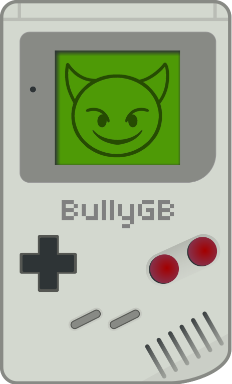

 

## What's this?

BullyGB is a fully modular Gameboy testing framework allowing for easy creation of hardware tests. Additionally, it comes with a load of test cases, ranging from easy-to-pass to very intricate and special-edge-case behavior.

## Can I contribute?

Sure! Everything you need to know is written in the `src/tests.asm` file. An explicit contributing guidelines file will be added soon(tm).

## What test cases are there?

Have a look at the [Wiki](https://github.com/Hacktix/BullyGB/wiki) where all tests are listed and documented.